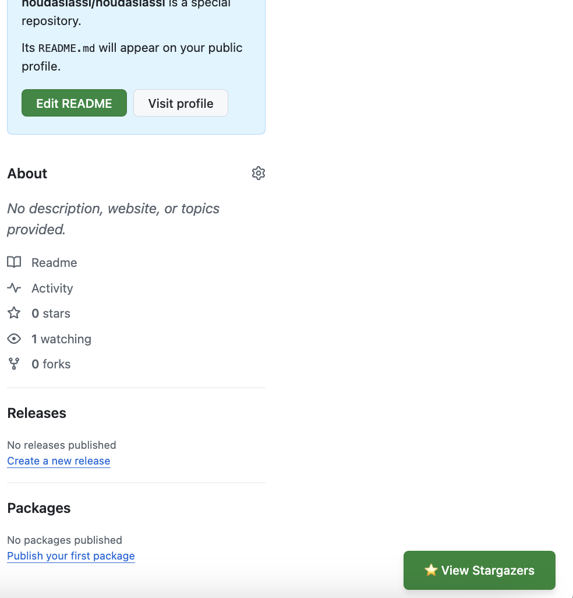
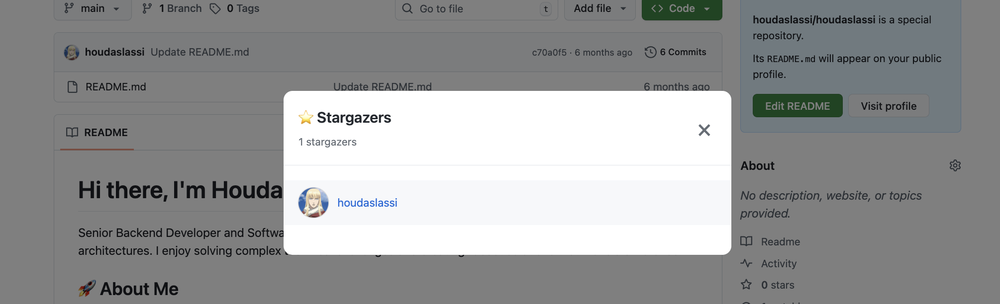

# ⭐ GitHub Stargazer Viewer

A simple and elegant browser extension that lets you see who starred any GitHub repository.

## 🎯 What It Does

GitHub removed the ability to easily see who starred your repositories. This extension brings that feature back!

Simply visit any GitHub repository and click the **"⭐ View Stargazers"** button to see everyone who has starred it.

## ✨ Features

- ⭐ **View All Stargazers** - See everyone who starred any public repository
- 📊 **Stargazer Count** - Total count displayed at the top
- 📄 **Pagination** - Load all stargazers with "Load More" button
- 🎨 **Beautiful UI** - Clean, modern interface integrated into GitHub
- ⚡ **Fast & Lightweight** - Quick API calls, minimal resources
- 🔒 **Privacy First** - No data collection, uses only GitHub's public API

## 📸 Screenshots

### View Stargazers Button
The extension adds a convenient button on any GitHub repository page:

### Stargazers Modal
Click the button to see all stargazers in a beautiful modal:

## 🚀 How to Install

### Option 1: Chrome Web Store (Recommended)
1. Visit the Chrome Web Store link (once published)
2. Click "Add to Chrome"
3. Done! 🎉

### Option 2: Manual Installation (Developer Mode)
1. Download this repository
2. Extract the ZIP file
3. Open Chrome and go to `chrome://extensions/`
4. Enable "Developer mode" (top right)
5. Click "Load unpacked"
6. Select the `dist` folder from this repository

## 📖 How to Use

1. **Visit any GitHub repository**
   - For example: `https://github.com/vuejs/vue`

2. **Look for the button**
   - You'll see a green **"⭐ View Stargazers"** button in the bottom-right corner

3. **Click the button**
   - A modal will open showing all stargazers

4. **Browse stargazers**
   - Scroll to see more
   - Click "Load More" to fetch additional pages (if repo has 30+ stargazers)
   - Click on any username to visit their profile

5. **Close the modal**
   - Click the × button or click outside the modal

## 🔧 Technical Details

- **Built with:** Vue.js 3
- **API:** GitHub REST API v3
- **Manifest:** V3
- **Permissions:** 
  - `storage` - For extension preferences
  - `https://api.github.com/*` - To fetch stargazers data

## 🔒 Privacy

- ✅ **No data collection** - We don't collect or store any personal information
- ✅ **No tracking** - No analytics or user tracking
- ✅ **Public API only** - Uses only GitHub's public API
- ✅ **Local storage** - All data stays in your browser

## 🤝 Contributing

Contributions welcome! Feel free to:
- Report bugs
- Suggest features
- Submit pull requests

## 📝 License

MIT License - Feel free to use this project for your own extensions!

## 🐛 Issues

Found a bug or have a feature request? Please open an issue on GitHub.

## ⭐ Show Your Support

If you find this extension useful, please star the repository!

---

**Made with ❤️ for the GitHub community**

